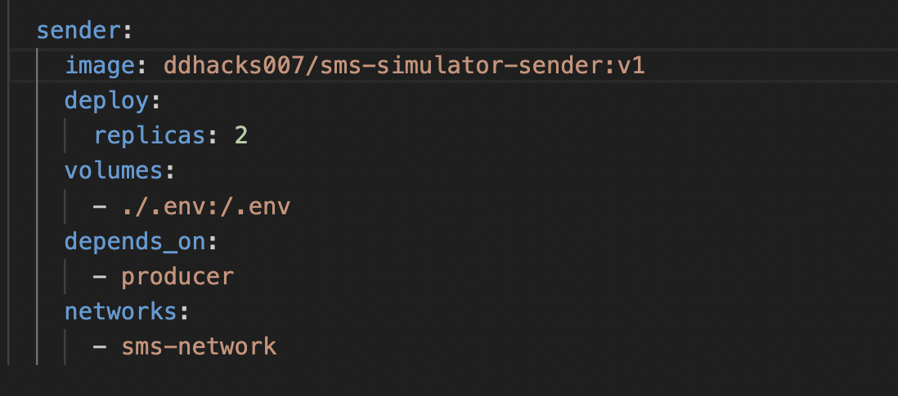

# SMS-Simulator Project

The SMS-Simulator is a sophisticated application designed to emulate the sending and receiving of SMS messages via a message broker system. It leverages RabbitMQ for message queuing, Redis for caching, and Logstash for logging, ensuring efficient and reliable message processing.

## Configuration

Major parameters are configured inside the .env file, for some parameters you need to configure it in the docker-compose file and in the kibana dashboard.

### Producer

To adjust the number of messages produced, modify the `TOTAL_MESSAGES` field in the producer section of the environment file.

- **TOTAL_MESSAGES**: `10000`
  - This parameter sets the total number of messages to be produced.
- **PRODUCER_RUN_FOREVER**: `False`
  - This parameter determines whether the producer should run indefinitely.
- **PRODUCER_MSG_DELAY**: `0.5`
  - This parameter sets the delay (in seconds) between producing each message.

### Sender

ou can adjust the number of senders by modifying the `replicas` field in the Docker Compose file under the sender service.

To configure the mean processing time and failure rate for each sender, update the `MESSAGE_PROCESSING_TIME` and `FAILURE_RATE` parameters in the environment file. Y

- **MESSAGE_PROCESSING_TIME**: `[[0.5, 0.1], [0.4, 0.1]]`
  - The first parameter is the mean processing time in seconds, and the second parameter is the standard deviation.
- **FAILURE_RATE**: `[[0.9], [0.9]]`
  - This parameter sets the failure rate for message processing, where each value represents a percentage (e.g., 0.9 corresponds to a 90% success rate).
