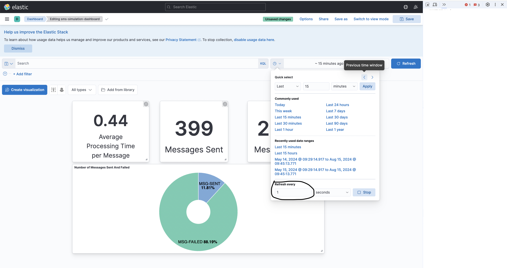

# SMS-Simulator

The SMS-Simulator is an application designed to emulate the sending and receiving of SMS messages using a message broker system. It utilizes RabbitMQ for message queuing, Redis for providing unique IDs to the senders (ranging from 0 to the number of senders), ids are used to retrieve processing time and failure rate parameters, Logstash for logging, Elasticsearch for storing logs, and Kibana for monitoring the progress of messages sent, failed, and their average processing times.

## Architecture Diagram


## Configuration

Major parameters are configured inside the .env file, for some parameters you need to configure it in the docker-compose file and in the kibana dashboard.

### Producer

To adjust the number of messages produced, modify the `TOTAL_MESSAGES` field in the producer section of the environment file.

- **TOTAL_MESSAGES**: `10000`
  - This parameter sets the total number of messages to be produced.
- **PRODUCER_RUN_FOREVER**: `False`
  - This parameter determines whether the producer should run indefinitely.
- **PRODUCER_MSG_DELAY**: `0.5`
  - This parameter sets the delay (in seconds) between producing each message.

### Sender

ou can adjust the number of senders by modifying the `replicas` field in the Docker Compose file under the sender service.


To configure the mean processing time and failure rate for each sender, update the `MESSAGE_PROCESSING_TIME` and `FAILURE_RATE` parameters in the environment file. Length of `MESSAGE_PROCESSING_TIME` and `FAILURE_RATE` equals number of senders

- **MESSAGE_PROCESSING_TIME**: `[[0.5, 0.1], [0.4, 0.1]]`
  - The first parameter is the mean processing time in seconds, and the second parameter is the standard deviation used for generating random values from gaussian distribution.
- **FAILURE_RATE**: `[[0.9], [0.9]]`
  - This parameter sets the failure rate for each sender which will be used to generate failure count from bernoulli distribution.

### Progress Monitor

To change the refresh rate in a Kibana dashboard, follow these steps:

1. **Open the Dashboard**: Navigate to the dashboard you want to modify in Kibana.

2. **Click on "Refresh" Button**: In the top-right corner of the dashboard, you'll see a "Refresh" button. Click on it.

3. **Select a Refresh Interval**: A dropdown menu will appear with various options for refresh intervals. You can choose from options like 5 seconds, 10 seconds, 30 seconds, 1 minute, etc. Additionally, you can select "Off" if you don't want the dashboard to automatically refresh.

4. **Save the Dashboard**: Once you've selected the desired refresh interval, you can save the dashboard if you want to retain this setting for future use.

#### Refresh rate



## Steps to Run

Run the following command to execute the test cases (make sure 21 test cases gets passed!):
`python -m unittest tests/*.py`

Run the following command to start your containers:

```sh
docker-compose up
```

Once the containers are up and running, follow these steps:

### Importing Saved Objects

1. **Go to Kibana**: Open your Kibana instance in your web browser by navigating to `http://localhost:5601`.
2. **Navigate to Management**: Click on the "Stack Management" (or "Management" in older versions) menu in the left sidebar.
3. **Saved Objects**: Under "Kibana", click on "Saved Objects".
4. **Import**: Click on the "Import" button.
5. **Upload File**: Choose the `export.ndjson` file in the repository.
6. **Complete Import**: Click "Import" to complete the process.

### Navigate to Dashboard

1. **Side Navigation Bar**: Look for the side navigation bar on the left side of the screen. It has icons for different Kibana apps.
2. **Dashboards**: Click on the "Dashboard" icon. The icon looks like a graph or a chart.
3. **Dashboard List**: Once you click the "Dashboard" icon, you will be taken to the list of dashboards. Here, you can see all the saved dashboards.
4. **Open a Dashboard**: Click on the `sms-simulation-dashboard` to open it.

By following these steps, you can import saved objects into Kibana and navigate to your desired dashboard to visualize your data.
